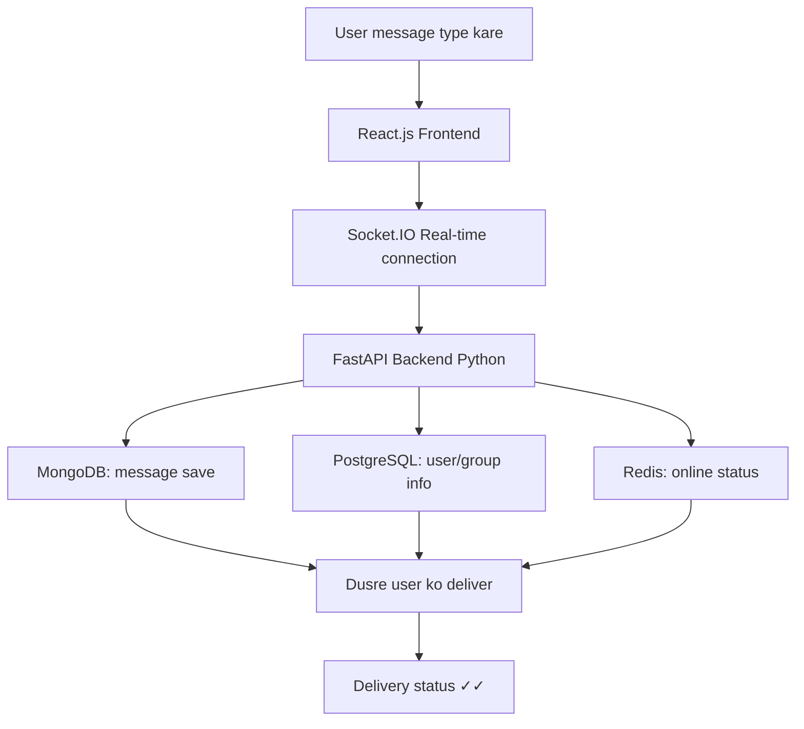

# WhatsApp Clone

React + FastAPI starter structure for a WhatsApp-style chat app.

## Folders

- `frontend`: React app with pages, components, context, hooks, and API helper.
- `backend`: FastAPI app with routes, models, schemas, sockets, and utilities.
- `database`: PostgreSQL schema and MongoDB collection setup.

## Backend Structure

```text
backend/
  main.py
  database.py
  models.py
  auth.py
  routes/
    auth.py
```

## Run Locally

```bash
docker compose up --build
```

Frontend: `http://localhost:5173`

Backend: `http://localhost:8000`

## Data Flow



1. User frontend me message type karta hai.
2. React app message ko Socket.IO ke through real-time backend tak bhejti hai.
3. FastAPI backend message validate karta hai aur required data services se connect hota hai.
4. MongoDB me chat messages save hote hain.
5. PostgreSQL users, groups, and membership info handle karta hai.
6. Redis online/offline status aur quick presence checks ke liye use hota hai.
7. Backend message dusre user ko real-time deliver karta hai aur delivery status `✓✓` return hota hai.
